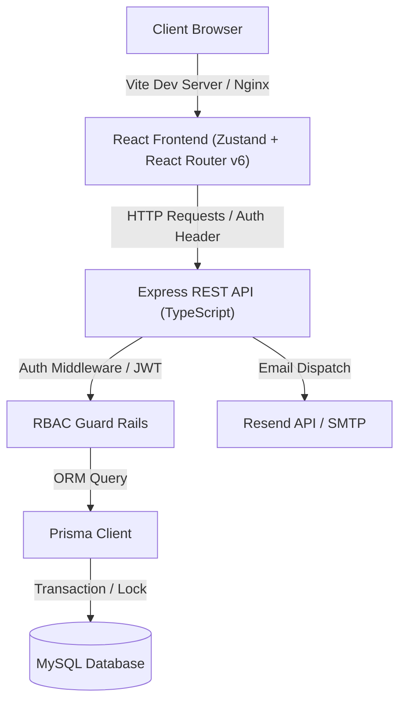

# TransitOps — Smart Transport Operations Platform

**Deployment Link:** [https://transitops-one-delta.vercel.app/login](https://transitops-one-delta.vercel.app/login)

TransitOps is a modern, enterprise-ready logistics and fleet management platform. It digitizes fleet scheduling, maintenance logs, operational expenses, and driver records while enforcing strict business rules, compliance requirements, and role-based access control.

---

## 🏗️ System Architecture

TransitOps is built as a split-monolith containing a decoupled React frontend and an Express REST API backend, sharing a synchronized MySQL database.



---

## 🌟 Key Functional Features & Guard Rails

### 1. Compliance Engine (Driver Registry)
- **License Compliance**: System blocks dispatchers from assigning drivers with expired licenses (`licenseExpiry` < current date).
- **Visual Alerting**: License expiry dates are highlighted in Amber in the UI when within 30 days of expiry, and in Red when expired.
- **Status Exclusions**: Off-duty or suspended drivers are filtered out of selection pools.

### 2. Payload Enforcement (Weight Limits)
- **Automatic Load Checks**: During trip creation, the cargo weight (kg) is compared against the maximum capacity of the chosen vehicle. If the cargo weight exceeds the vehicle's capacity, the API throws a validation error and blocks transaction commit.

### 3. Atomic Dispatch & Completion Cascades
- **Atomic Dispatch**: Dispatching a trip (Draft → Dispatched) updates both the vehicle and driver status to `OnTrip` atomically inside a database transaction.
- **Completion Cascades**: Completing a trip (Dispatched → Completed) records odometer readings, fuel consumption, toll expenses, and atomically returns the driver and vehicle to `Available` status.

### 4. Safety & Maintenance Operations
- **Maintenance Block**: Opening a maintenance ticket (e.g. "Brake Service") automatically marks the vehicle as `InShop`, hiding it from active dispatch pools. Completing the ticket returns it to `Available`.
- **Brute Force Lockout**: Accounts are automatically locked out for 15 minutes after 5 consecutive failed login attempts.

---

## 🔑 Default Credentials

| Role | Email | Password | Sidebar Access |
|---|---|---|---|
| **Fleet Manager** | `admin@transitops.com` | `admin123` | Full access across all settings, fleet registry, drivers, expenses, and analytics |
| **Dispatcher** | `dispatcher@transitops.com` | `password123` | Create and dispatch trips; read-only fleet/maintenance view |
| **Safety Officer** | `safety@transitops.com` | `password123` | Manage driver compliance, safety scores, and maintenance logs |
| **Financial Analyst** | `finance@transitops.com` | `password123` | View expenses, fuel logs, and analytics reports |

---

## 🚀 Quick Startup Guide

To get both the Express API and React frontend running locally, follow these steps:

### 1. Initialize Backend
```bash
cd backend
npm install
cp .env.example .env
# Edit .env with your MySQL credentials, then run:
npx prisma migrate dev --name initial
npx ts-node prisma/seed.ts
npm run dev
```

### 2. Initialize Frontend
```bash
cd ../frontend
npm install
cp .env.example .env
npm run dev
```

### 3. Verification
- Frontend runs on: **http://localhost:5173**
- Backend runs on: **http://localhost:3001**

---

## 📖 Project Documentation Guides

Refer to these guides in the repository root for specific implementation details:
- 📑 [Logistics Business Rules](file:///c:/Users/Felix/Desktop/transitops/business_rules.md) — Exhaustive checklist of capacity limits and status overrides.
- 🔐 [RBAC Matrix](file:///c:/Users/Felix/Desktop/transitops/rbac.md) — Permission configurations and route-level guards.
- 🔑 [Default Seed Credentials](file:///c:/Users/Felix/Desktop/transitops/seed_credentials.md) — Accounts list and safety timeouts.
- ⚙️ [API Reference](file:///c:/Users/Felix/Desktop/transitops/api_reference.md) — Backend route endpoints mapping.
- 🧪 [Verification Checklist](file:///c:/Users/Felix/Desktop/transitops/tests.md) — Setup and logs for the Jest & Vitest testing suites.

---

*TransitOps © 2026*
